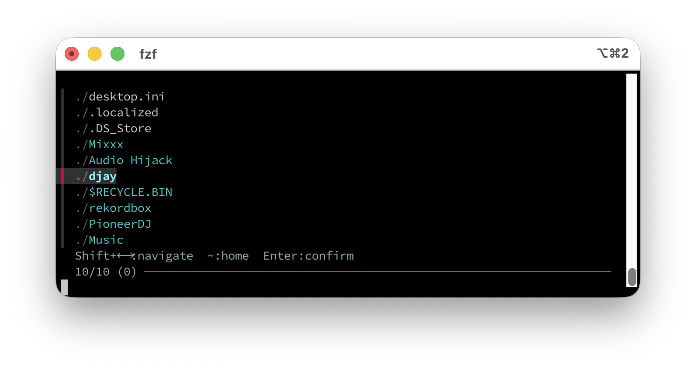

# zshift

**Smarter, faster file navigation for zsh.**

[日本語](README.ja.md)

Hit `Ctrl+T` and browse files and directories with fzf — navigate into folders with arrow keys, jump home with `~`, and insert clean paths into your command line. All without leaving zsh.

## Screenshot



## Why zshift?

| Stock fzf `Ctrl+T` | zshift |
|---|---|
| Flat list, search only | **Browse directories** with Shift+arrows |
| No visual distinction | **Cyan** = directory, **gray** = file |
| Retype path to go home | **`~` key** jumps home instantly |
| Long absolute paths | Auto-inserts short `~/…` or `./…` notation |

## Features

- **Shift+← / Shift+→** — navigate directories interactively
- **`~` key** — jump to home directory instantly
- **Multi-select** — `Tab` to pick multiple files, insert all at once
- Paths under `~/` are inserted with `~` notation preserved
- Paths under current directory are inserted with `./` prefix
- Permission errors shown as **pink inline warnings**

## Requirements

- **zsh**
- [**fzf**](https://github.com/junegunn/fzf)
- [**zoxide**](https://github.com/ajeetdsouza/zoxide) — fast directory jumping via `z` / `zi`

## Install

### Homebrew (recommended)

```zsh
brew install ayumuwall/tap/zshift
```

Then add to your `~/.zshrc`:

```zsh
source $(brew --prefix)/share/zshift/zshift.zsh
```

Then reload your shell:

```zsh
source ~/.zshrc
```

### zinit

```zsh
zinit light ayumuwall/zshift
```

### sheldon

```toml
[plugins.zshift]
github = "ayumuwall/zshift"
```

### Manual

```zsh
git clone https://github.com/ayumuwall/zshift.git ~/.zsh/zshift
echo 'source ~/.zsh/zshift/zshift.zsh' >> ~/.zshrc
```

## Usage

### `Ctrl+T` — File picker

Press `Ctrl+T` anywhere on the command line to browse the current directory:

```
  Documents/          # cyan = directory
  Downloads/
  ./README.md         # gray ./ = file
  ./setup.sh

  Shift+←→: navigate   ~: home   Enter: confirm
```

### Key bindings

| Key | Action |
|---|---|
| `Shift+→` | Enter selected directory |
| `Shift+←` | Go to parent directory |
| `~` | Jump to home directory |
| `Tab` | Toggle multi-select |
| `Enter` | Confirm and insert into command line |
| `Esc` | Cancel |

### `z` — zoxide integration

zshift initializes zoxide in `zi` (interactive) mode. Just type `z` to fuzzy-select from your recently visited directories.

## Tips

- If you've already typed a partial path, `Ctrl+T` starts browsing from there:
  ```
  vim src/<Ctrl+T>   # opens src/ contents
  ```
- The original fzf `Ctrl+T` is remapped to `Ctrl+G`, so it's always available.

## Platform

- **macOS** — fully supported
- **Linux** — requires `stat` adaptation (PRs welcome)

## License

[MIT](LICENSE)
